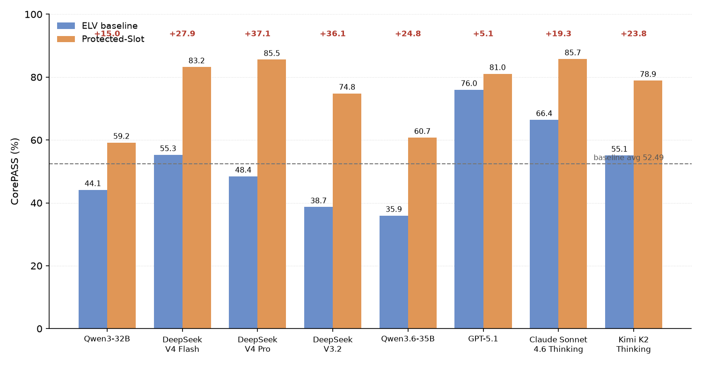

# RealTool-Loc

**评估多语言工具增强型 LLM Agent 忠实性的基准，以及把忠实性提升 +23.66pp 的 Protected-Slot 占位符策略**

论文：*From Tool Results to User Answers: Benchmarking Faithful Multilingual Realization in LLM Agents*（IALP 2026 投稿，第二作者）。本仓库随论文发布完整制品：1024 任务基准数据（`data/`）、确定性评估器（`src/realtool_loc/`）、四套实现策略 prompt（`prompts/`）与全部结果表（`results/`），评估代码零外部依赖，可直接复现论文数字。

[](https://github.com/JAVAYANGZHIWEI/realtool-loc/actions)
[](https://www.python.org/)
[](LICENSE)

## Main Results

**图 1：8 款模型在 ELV 基线与 Protected-Slot 策略下的 CorePASS（均值 52.49 → 76.15）**



`scripts/plot_results.py` 可复现上图，数据与下表同源（8 模型 × 4 策略 × 512 测试任务 = 16,384 条答案）。

从图里可以读出几个现象：

- **8/8 全正**：没有一款模型因为占位符化而受损，增益 +5.07 ~ +37.11pp
- **受益最大的是中低档模型**：DeepSeek V4 Pro（+37.11）、V3.2（+36.13）这类基线更容易改写字段值的模型，保护收益也最大；基线最强的 GPT-5.1 只 +5.07——基线能力越强，占位符能补的洞越小
- **平均线上移 23.66pp**：52.49% → 76.15%，95%CI [18.16, 29.32]
- **增益不是单类任务撑起来的**：96 个"多词英文语义文本"任务 31.77% → 87.11%（贡献 43.86% 新增通过），扣除后其余 416 任务仍 +16.35pp

## Background

Agent 调用工具时，评测通常只看"最终答案像不像"，没人检查填参数时是不是瞎填：航班号不存在也照样填进去（幻觉字段），用户明确给出的不可变信息被悄悄改写。低资源语种（藏语、维语、传统蒙文、阿拉伯字母哈萨克语等）连评测数据都是空白——忠实性无法量化，就无法横向对比模型，也无从定位错误环节。

## Method

**Protected-Slot** 分两阶段：把不可变/实体/语义类字段值替换成 `[[FIELD_xxx]]` 占位符后再让模型生成，生成完确定性还原；需要本地化的状态字段保持模型生成。动机是防乱编，不是防失败——缺失字段被占位符保护时显式声明缺失、其他字段照常执行，而不是靠模型猜。

## Benchmark & Metric

- **基准**：32 个公开工具 / 128 条静态记录 / 8 语种模板生成 1024 任务（dev/test 各 512，源记录不相交）
- **指标**：四类字段角色（不可变/实体/语义/状态）+ **CorePASS 复合指标**——7 项确定性检查连乘：语言脚本 L · 必填覆盖 C · 不可变保持 I · 实体保真 E · 语义保真 S · 本地化 Z · 无幻觉 H。一项不过整体 FAIL，无法用强项补偿；规则化、零成本、可复现
- **消融**：4 模型 × 64 记录 × 7 条件复合对比诊断（英-多语言差异最大 30.9–37.1pp；显式证据契约 +12.9/+8.2pp）
- **双辅助评估**：Gemini 3.1 Pro 抽 30% 样本评语义忠实（44.64→64.20）；Claude Sonnet 4.6 Thinking 独立抽 30% 评自然度（3.838→3.475，Δ−0.363 诚实披露）——主指标不依赖 LLM 裁判

## Results

| 模型 | ELV (%) | Protected (%) | Δ (pp) |
|---|---|---|---|
| Qwen3-32B-4bit | 44.14 | 59.18 | +15.04 |
| DeepSeek V4 Flash | 55.27 | 83.20 | +27.93 |
| DeepSeek V4 Pro | 48.44 | 85.55 | **+37.11** |
| DeepSeek V3.2 | 38.67 | 74.80 | +36.13 |
| Qwen3.6-35B-A3B (无思考) | 35.94 | 60.74 | +24.80 |
| GPT-5.1 | **75.98** | 81.05 | +5.07 |
| Claude Sonnet 4.6 Thinking | 66.41 | **85.74** | +19.33 |
| Kimi K2 Thinking | 55.08 | 78.91 | +23.83 |
| **平均** | **52.49** | **76.15** | **+23.66** |

## Reproduction

本仓库包含论文的完整制品：

```
data/                  1024 任务基准 + 448 attribution 任务（见 data/README.md）
src/realtool_loc/      确定性评估器：字段角色 / Protected-Slot / 多策略 prompt 生成
prompts/               四种实现策略（naive / field-constrained / ELV / Protected-Slot）
scripts/               数据校验、拆分复现、结果算术复现、评测运行脚本
results/               论文全部结果表（frozen CSV）
tests/                 官方回归测试（unittest）+ 复刻层测试（pytest），CI 自动执行
src/corepass_checker.py  复刻层：字段角色 / Protected-Slot / 类型匹配 的最小判定实现
scripts/plot_results.py  图 1 的绘制脚本
```

```bash
python -m venv .venv && source .venv/bin/activate
pip install -e ".[dev]"
pytest          # 全部测试
PYTHONPATH=src python3 scripts/validate_dataset.py    # 数据集完整校验
PYTHONPATH=src python3 scripts/reproduce_results.py --check   # 复现论文结果数字
PYTHONPATH=src python3 scripts/evaluate_predictions.py \
  --predictions examples/predictions.jsonl --output /tmp/example.strict.json \
  --evaluation-policy strict
python -m src.corepass_checker   # 复刻层演示（4 case）
```

复刻层真实输出（4 个 case 覆盖三类核心判定）：

```
PASS | 查询公司名:统信软件 金额:5200 | -                     <- 全字段正确
PASS | 查询公司名:统信软件 金额:5200 | -                     <- 缺公司名但 Protected-Slot 保护
FAIL | 查询公司名:统信软件 金额:5200 | 不可变字段被改写: 公司名  <- 不可变信息被篡改
FAIL | 查询公司名:统信软件 金额:5200 | 类型失配: 金额(期望int, 得到str)
CorePASS: 2/4 通过  (论文: Protected-Slot策略 76.15% vs 基线52.49%, +23.66pp)
```

## Data Notes

完整基准数据随仓库发布（`data/realtool_loc.jsonl`，1024 任务，版本 `real_tool_mvp_v3`）。实测与论文的一致性核对见 `data/SCHEMA.md`：除 food 域一条记录的 status/semantic 归类口径差（8 样本）外全部吻合；论文中的 76.15% 对应 8 模型 × 4 策略 × 512 测试任务 = 16,384 条答案，可用 `scripts/reproduce_results.py --check` 复核。

## License

MIT © 2026 JAVAYANGZHIWEI